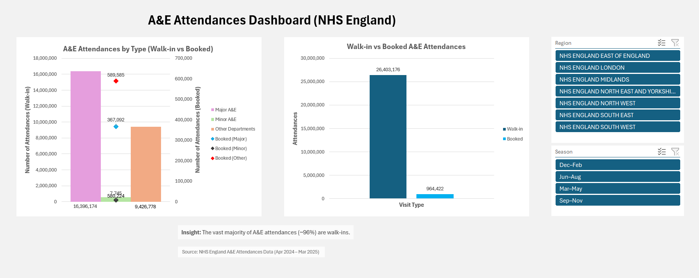

## Overview
This project analyses A&E performance across NHS England using publicly available data.  
It combines attendance patterns and waiting time performance to understand both demand and system pressure.

---

## Objectives
- Analyse A&E attendances across departments and pathways
- Evaluate 4-hour delay performance across A&E types
- Compare walk-in vs booked attendance pathways
- Normalise metrics to ensure fair comparison
- Enable dynamic filtering by region and season

---

## Tools & Technologies
- Microsoft Excel
- Power Query (data cleaning & transformation)
- Pivot Tables & Pivot Charts
- Data visualisation & dashboard design principles

  

## Dashboard 1: A&E Attendances

## Overview
This project analyses A&E attendances across NHS England using publicly available data.  
The objective was to understand how demand is distributed across A&E types and attendance pathways.

---

## Objectives
- Analyse attendances across A&E types
- Compare walk-in vs booked attendance pathways
- Examine demand distribution across services
- Enable dynamic filtering by region and season

---

## Dashboard Features
- Interactive slicers:
  - Region
  - Season
- Comparison of:
  - Type 1, Type 2, and Other A&E departments
  - Walk-in vs Booked pathways
- Clean, structured layout for readability and usability

---

## Key Insights
- The vast majority of A&E attendances are walk-ins (~96%)
- Booked appointments represent a very small proportion of total demand
- Type 1 A&E accounts for the largest share of attendances
- Demand patterns vary across regions and seasons

---

## Data Source
NHS England A&E Attendances Data (Apr 2024 – Mar 2025)

  

## Dashboard 2: A&E 4-Hour Delays

## Overview
This project analyses A&E waiting time performance across NHS England using publicly available data.  
The objective was to determine whether higher delays are driven by overall attendance volume or underlying performance differences.

---

## Objectives
- Analyse 4-hour delay breaches across A&E types
- Compare walk-in vs booked attendance pathways
- Normalise metrics to ensure fair comparison across categories
- Enable dynamic filtering by region and season

---

## Dashboard Features
- Interactive slicers:
  - Region
  - Season
- Comparison of:
  - Type 1, Type 2, and Other A&E departments
  - Walk-in vs Booked pathways
- Clean, structured layout for readability and usability

---

## Key Insights
- Type 1 A&E shows significantly higher delay rates (~41%)
- Type 2 and Other departments have much lower delay rates (~3–4%)
- Differences persist even after adjusting for attendance volume
- Indicates structural pressure rather than volume alone
- Delay patterns vary across regions, highlighting geographic disparities

---

## Data Source
NHS England A&E Attendances Data (Apr 2024 – Mar 2025)
